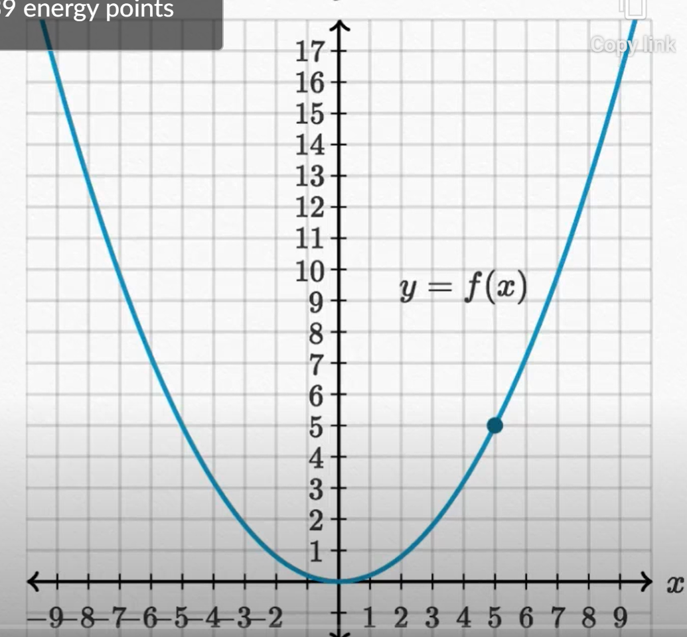
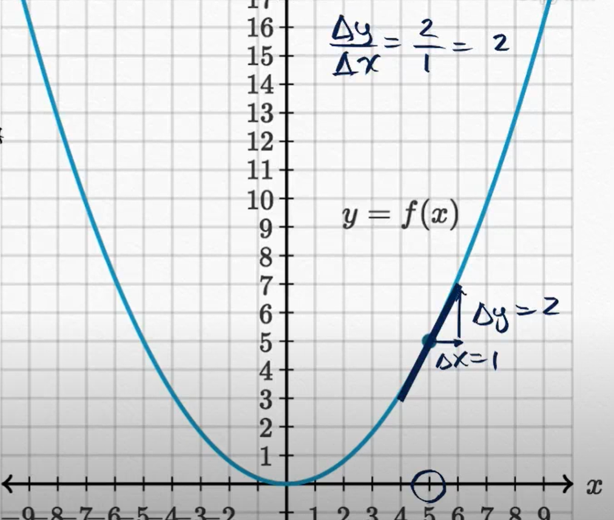
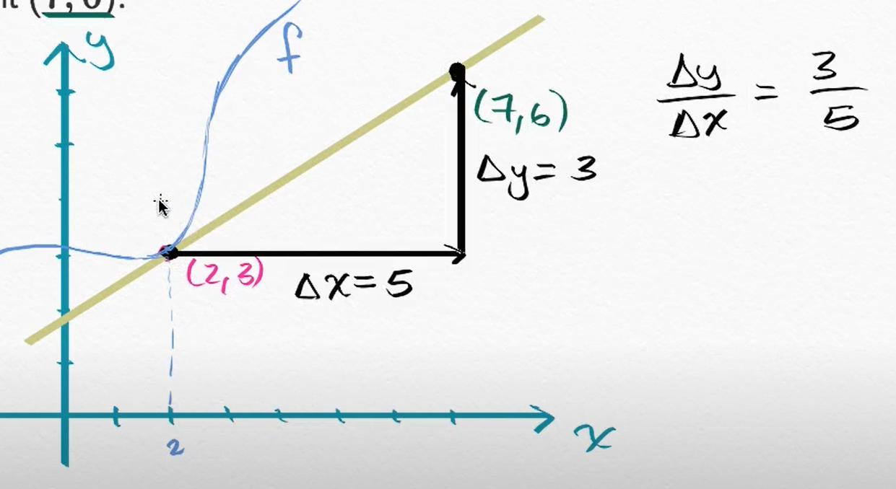

# Derivatives

Newton and Leibniz did most of their work in the late 1600.

What is the instantaneous rate of change of something and how fast something is going *right now*. This is what differential calculus is about. 

With Hussein bolt capable of running 100m in 9.58s, we can determine his average speed as $\frac{\Delta \mathrm{distance}}{\Delta \mathrm{time}}$ which is equivalent in the graph below to $\frac{\Delta x}{\Delta y}$ which is equal to $\frac{100 \mathrm{m}}{9.58\mathrm{s}} = 10.4\mathrm{m/s}$. 

What we just calculated is the average speed.

The real curve of his speed would look more like this:

To calculate the real rate of change at any point, 

we want to find $\lim\limits_{\Delta x \to 0}\frac{\Delta y}{\Delta x}$ which will give use the isntantaneous slope, called the derivative denoted as $\frac{dy}{dx}$. Both of these terms are called differentials.

## Concept

The lope of a line is relating a vertical axis to the horizontal axis.

On the line the difference between the two points is called "change in $x$" and change in "$x$" where "change" is written as $\Delta$. The slope is defined as $\frac{\Delta y}{\Delta x}$ and sometimes described as "rise over run". It is associated with a slope because it has a constant rate of change. This slope is a line because this rate will be the same no matter what two point we chose. 

Using derivatives we will calculate the rate of change of points on a curve. 

Using a line tengant to $x_1$ we can get the instantaneous rate of change by calculating the slope of the tangent.

The slope of the tangent line, which is the instantaneous rate of change, is the derivative.

### Leibniz notation

$\frac{dy}{dx}$ called differential notation where $d$ denotes "very small changes in $y$ or $x$".

### Lagrange notation

For a function $y = f(x)$ the derivative (slope of the tangent line) would be noted as  $ = f'(x_1)$

Can also be noted $y'$ or $\dot y$. 

## Secant lines

For $y = x^2$. We want the average rate of change ove $[1, 3] $

The average rate in change is $\frac{\Delta y}{\Delta x} = \frac{8}{2} = 4$

## Derivative as slope curve

Estimate $f^\prime(5)$, that is the slope of the tangent line at 5.

$\frac{\Delta y}{\Delta x} = \frac21 = 2$

## The derivative & tangent line equations

### 1

The tangent line to the graph of function $f$ at the point $(2, 3)$ passes through the point $(7, 6)$

Find $f^\prime(2)$.

$f^\prime = \frac{\Delta y}{\Delta x} = \frac35$

### 2

For a function $g$, we are given that $g(-1) = 3$ and $g^\prime(-1)=-2$.

What's the equation of the tangent line to the graph of $g$ at $x = -1$
$$
\begin{align*}
y &= mx+b \\
 &= -2x+b \\
3 &= -2(-1)+b \\
 &= 2+b \\
1 &= b \\
y &= -2x+1
\end{align*}
$$

